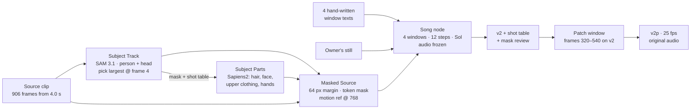

# Postmortem: the lotsofpeopledance masked render, end to end

> **Written without the session transcripts.** A cloud session wrote this on
> 2026-10-10 from git history, `bench/results/`, the wiki and the masking
> board; every request for the sessions' transcripts was refused by the
> account's trusted-device setting. An owner verdict quoted here is as a
> session relayed it on the board. A session that worked on this render can
> check its part against its own transcript (`~/.claude/projects/`): where the
> two differ, add a dated annotation under the finding and leave the finding
> as written. The final render's four window texts and its graph are not in
> the tree; if a transcript holds them, add them under "The prompts".
> Rendered page: https://claude.ai/artifact/AoSLjZYx1e5VqfWZg43rPK

## The short version

On 2026-10-08 at 15:23 CDT the owner accepted a one-window patch over render v2. The patched result, `Video/mryo/v2p/v2p_final_25fps_original_audio.mp4`, is the clip with one man in a crowd replaced by the owner's own still, from his first draw on a cigarette, through climbing into the packed rows, to the dancing. The board card marked it done at 15:26 CDT [board today-2026-10-08-lotsofpeopledance-end-to-end](https://claude.ai/artifact/Byvp9hbg99FDdB27c9wq4B). The masked lane behind it started on 2026-10-04 [718dd3a5](https://github.com/fblissjr/ComfyUI-h3-explorations/commit/718dd3a5). The clip itself only became the test clip on 2026-10-07 [board goal-second-clip-end-to-end](https://claude.ai/artifact/Byvp9hbg99FDdB27c9wq4B).

- **What made it work was the text, not the mask.** Three renders that each differed in one field showed that four hand-written prompts, one per window, kept the subject on screen. The node's single generic text lost him from about frame 305. The subject-sized margin built that morning was not needed [board mhi-07](https://claude.ai/artifact/Byvp9hbg99FDdB27c9wq4B).
- **The hardest problem was the hole, not the tracker.** On the crowd clip SAM held the subject. The trouble was the fixed 64 px margin: once he was small it covered other people, and H3 drew the new subject on the person standing in front of him [board top-the-hole-is-too-big](https://claude.ai/artifact/Byvp9hbg99FDdB27c9wq4B).
- **The cheapest fix of the whole effort was the owner's idea.** Redrawing only the faulty 12 seconds of a finished render took ten minutes of the card, where a full re-render would have taken about 45. It joined with no visible seam [board mhi-09](https://claude.ai/artifact/Byvp9hbg99FDdB27c9wq4B).
- **Most of the faults could have been seen before rendering, and were seen only after.** Stray specks in the mask, a part mask on the wrong person and a region several times the subject's size were all in data the graph already produced. A preflight that reads that data was built on 2026-10-10, two days after the render [c000b38c](https://github.com/fblissjr/ComfyUI-h3-explorations/commit/c000b38c).
- **The record of the final render is thin.** Its graph, its four prompts and the scripts that measured it lived in session scratchpads that were "not kept" [board msx-08](https://claude.ai/artifact/Byvp9hbg99FDdB27c9wq4B). The only copy of the final prompts is the workflow embedded in `Video/mryo/v2/v2_00001.png` on the owner's machine [`bench/results/2026-10-09_masked_text_and_edge_one_window.json`](https://github.com/fblissjr/ComfyUI-h3-explorations/blob/a5c54dde419b2366885b0ffa413c9c9a5f13af63/bench/results/2026-10-09_masked_text_and_edge_one_window.json).

## What this is built from

**Primary evidence used.** The repository's full git history (unshallowed; 2,225 commits on main, about 160 of them on this lane between 2026-10-04 and 2026-10-10). The `bench/results/` records. The wiki pages [`docs/wiki/masked_v2v.md`](https://github.com/fblissjr/ComfyUI-h3-explorations/blob/a5c54dde419b2366885b0ffa413c9c9a5f13af63/docs/wiki/masked_v2v.md), [`docs/wiki/decisions.md`](https://github.com/fblissjr/ComfyUI-h3-explorations/blob/a5c54dde419b2366885b0ffa413c9c9a5f13af63/docs/wiki/decisions.md), [`docs/wiki/next_steps.md`](https://github.com/fblissjr/ComfyUI-h3-explorations/blob/a5c54dde419b2366885b0ffa413c9c9a5f13af63/docs/wiki/next_steps.md) and [`docs/wiki/sam3_prompting.md`](https://github.com/fblissjr/ComfyUI-h3-explorations/blob/a5c54dde419b2366885b0ffa413c9c9a5f13af63/docs/wiki/sam3_prompting.md). The session research notes under `docs/research/masking/`. And the masking board's database: 179 dated findings, 91 owner comments with session replies, and 117 cards, read with ArtifactData on 2026-10-10.

**Not reachable.** The session transcripts themselves. The sessions exist (mrdragon, mregg, mryolk, mrgrass, mrsound, mrhen and mrsampr on 2026-10-07; mryo, mrhi, mrsix, mrunder and mrgrow on 2026-10-08), but every transcript request was refused by the account's "require trusted devices" setting. So every claim below rests on what those sessions wrote into the repo or onto the board while they worked, not on their raw logs. The gitignored `internal/` and `data/` folders and the sessions' scratchpads are also absent. Where a finding depends on one of them, the sentence that carries it is quoted from the board.

**Conventions.** Times are the owner's local time (CDT, UTC−5). Board timestamps are UTC and were converted. "Board mhi-09" is a finding id, and a hyphenated slug is a card. Anything marked *inferred* is a reading of the record, not something it states.

## Timeline

### Before this clip: the lane is built on other footage (2026-10-04 to 2026-10-06)

- **10-04 12:01.** Masked video-to-video ships on the song node: a source video's subject is replaced from a reference still [718dd3a5](https://github.com/fblissjr/ComfyUI-h3-explorations/commit/718dd3a5).
- **10-04 13:19.** Second clip, six people. One SAM phrase cannot isolate one person, because the tracker's object cap is spent on the others [38809e10](https://github.com/fblissjr/ComfyUI-h3-explorations/commit/38809e10).
- **10-04 15:46–18:38.** The Subject Track node is written, reworked twice the same afternoon, and given a head check after it took two other women as the lead on a car clip [0987bb40](https://github.com/fblissjr/ComfyUI-h3-explorations/commit/0987bb40) [52bb0201](https://github.com/fblissjr/ComfyUI-h3-explorations/commit/52bb0201) [f94c736b](https://github.com/fblissjr/ComfyUI-h3-explorations/commit/f94c736b). The rule "was chosen on the clips it passes" [`bench/results/2026-10-04_subject_track_three_clips.md`](https://github.com/fblissjr/ComfyUI-h3-explorations/blob/a5c54dde419b2366885b0ffa413c9c9a5f13af63/bench/results/2026-10-04_subject_track_three_clips.md).
- **10-04, owner rules.** No control adapter. Whole subject by default. Every SAM phrase is visible and editable. Naming the movement in the prompt is not the answer [board my-09](https://claude.ai/artifact/Byvp9hbg99FDdB27c9wq4B).
- **10-05.** The original's movement reaches the new subject only through a motion reference on the ref2va checkpoint at more than eight evaluations [board my-21](https://claude.ai/artifact/Byvp9hbg99FDdB27c9wq4B) [board my-22](https://claude.ai/artifact/Byvp9hbg99FDdB27c9wq4B). The base text turns out to be part of the mechanism, not a knob [board my-27](https://claude.ai/artifact/Byvp9hbg99FDdB27c9wq4B). VOID is tested and parked: "Not a single clip showed any improvement" [board mo-08](https://claude.ai/artifact/Byvp9hbg99FDdB27c9wq4B). The shot table and typed corrections (`shot 3: person 2`) land [448b60c8](https://github.com/fblissjr/ComfyUI-h3-explorations/commit/448b60c8) [5ad065fb](https://github.com/fblissjr/ComfyUI-h3-explorations/commit/5ad065fb).
- **10-06.** A node writes the masked prompt [45a9fb3c](https://github.com/fblissjr/ComfyUI-h3-explorations/commit/45a9fb3c). The tracker looks again after a loss [cb88a768](https://github.com/fblissjr/ComfyUI-h3-explorations/commit/cb88a768). The part model is shown the subject alone, after it labelled the people in front [131cc6d6](https://github.com/fblissjr/ComfyUI-h3-explorations/commit/131cc6d6). The upper-body recipe is called "solid" by the owner [board mj-08](https://claude.ai/artifact/Byvp9hbg99FDdB27c9wq4B). Meta's SAM 3.1 code is copied in as a reference [7d12939f](https://github.com/fblissjr/ComfyUI-h3-explorations/commit/7d12939f). The frozen-row cache is retired on a run that later turned out to have timed the wrong attention kernel [c2777ad9](https://github.com/fblissjr/ComfyUI-h3-explorations/commit/c2777ad9) [board md-01](https://claude.ai/artifact/Byvp9hbg99FDdB27c9wq4B).

### 2026-10-07: the crowd clip arrives, and the day goes to SAM

- **10:11.** The upper-body masked graph ships on the ref2va motion base [c93b5301](https://github.com/fblissjr/ComfyUI-h3-explorations/commit/c93b5301).
- **10:40.** Found in our own call: with a count of one, `person:1` reached SAM's tokenizer as words. Fixed [25baf9d6](https://github.com/fblissjr/ComfyUI-h3-explorations/commit/25baf9d6) [board me-11](https://claude.ai/artifact/Byvp9hbg99FDdB27c9wq4B).
- **Morning (mregg, mryolk, mrgrass).** SAM 3.1 is audited against Meta's code. Two real faults turn up in ComfyUI's port. Images are fed in 0..1 where the model was trained on −1..1 [board me-12](https://claude.ai/artifact/Byvp9hbg99FDdB27c9wq4B), and the text encoder runs the wrong activation [board me-13](https://claude.ai/artifact/Byvp9hbg99FDdB27c9wq4B). Half precision is ruled out as a lever [dba6a894](https://github.com/fblissjr/ComfyUI-h3-explorations/commit/dba6a894). Results flip on a two-grey-level change in decoding, and the lead session writes "I stop claiming things about the tracker from single runs" (18:25 Z comment on q-sam3-route-after-the-read).
- **11:04.** The end-to-end render is re-aimed from vma.mp4 to `lotsofpeopledance_0414_0720.mkv`, "with the windows picked as we go" [board goal-second-clip-end-to-end](https://claude.ai/artifact/Byvp9hbg99FDdB27c9wq4B).
- **12:55.** Owner: "Being able to confidently track objects/subjects/segmented subjects in crowded scenes and across shots is super important and we have to get that right first."
- **13:09.** Owner: "lets also make sure we try different prompts for both sam and for h3. we should consult the h3 vendor prompting guide … ensuring we're getting the h3 prompt for ref2va video masking correct is pretty dang important."
- **14:06.** On the clip's hard stretch the tracker's lead over the next-best person is about 0.03, exactly the threshold, so "the thinnest cases are a coin toss" [board me-16](https://claude.ai/artifact/Byvp9hbg99FDdB27c9wq4B).
- **15:58.** The key correction of the day: every measurement so far followed the *largest* person, a front-row figure. With pick = "most central", the person the owner means is held on all 144 frames of the "hard" stretch [board me-20](https://claude.ai/artifact/Byvp9hbg99FDdB27c9wq4B). Default changed at 16:04 [4792ed30](https://github.com/fblissjr/ComfyUI-h3-explorations/commit/4792ed30). Two earlier findings are withdrawn or rewritten [board me-19](https://claude.ai/artifact/Byvp9hbg99FDdB27c9wq4B) [board me-15](https://claude.ai/artifact/Byvp9hbg99FDdB27c9wq4B).
- **16:51.** The owner's verdicts on four stacked videos. A region switched on mid-shot shows the new subject 5 to 24 frames late. Keeping a patch of real pixels inside the region brings the original man back [board watch-2026-10-07-stacked-videos](https://claude.ai/artifact/Byvp9hbg99FDdB27c9wq4B).
- **17:37.** The prompt node's upper-body text is rewritten in the vendor guide's form at under half its length. It drops "turning when they turn … gesturing when they gesture" [eb44baea](https://github.com/fblissjr/ComfyUI-h3-explorations/commit/eb44baea).
- **18:36.** The source is loaded in one resize instead of two, which recovers about a fifth of the fine detail [b93c5530](https://github.com/fblissjr/ComfyUI-h3-explorations/commit/b93c5530).
- **19:48 → 20:11.** Sixteen steps, then back to twelve on the owner's verdict that the two looked the same [42aa78f2](https://github.com/fblissjr/ComfyUI-h3-explorations/commit/42aa78f2) [252931b8](https://github.com/fblissjr/ComfyUI-h3-explorations/commit/252931b8).
- **Evening.** A window starting at 16.75 s, with the subject small and pinned as `shot 1: person 8`, loses him at frame 203. Corrected shots were never searched again after a loss. Fixed at 20:11 [0408a1f1](https://github.com/fblissjr/ComfyUI-h3-explorations/commit/0408a1f1). The first confirmation render showed no change because a stale stored mask was loaded, so the mask version was bumped [5c7e963b](https://github.com/fblissjr/ComfyUI-h3-explorations/commit/5c7e963b) and both disk stores were switched off in code [7e1285ee](https://github.com/fblissjr/ComfyUI-h3-explorations/commit/7e1285ee).
- **~21:00.** With the mask now continuous, the subject disappears into the crowd and the person in front becomes him. Owner: "so we made the hole too big" [board top-the-hole-is-too-big](https://claude.ai/artifact/Byvp9hbg99FDdB27c9wq4B).

### 2026-10-08: render day

- **09:27–09:35.** Diagnosis with nothing sampled, from a preview of masks only. Window two's stillness is a broken hand-over that starts about 1.5 s before its first new frame, where the part mask sits on the person in front [board mhi-01](https://claude.ai/artifact/Byvp9hbg99FDdB27c9wq4B) [board mhi-02](https://claude.ai/artifact/Byvp9hbg99FDdB27c9wq4B). The region measures about 2, 5.5 and 8 times his area across the windows [board mhi-03](https://claude.ai/artifact/Byvp9hbg99FDdB27c9wq4B). The motion reference's "zoom" at its largest setting is not a zoom [board mhi-04](https://claude.ai/artifact/Byvp9hbg99FDdB27c9wq4B).
- **09:58.** A margin sized to the subject, and a part hold for frames whose part mask it does not trust [c986b2c7](https://github.com/fblissjr/ComfyUI-h3-explorations/commit/c986b2c7) [d5512ff0](https://github.com/fblissjr/ComfyUI-h3-explorations/commit/d5512ff0). mrsix reviews both by running old and new code side by side over 192 setting combinations and by breaking the code deliberately [board msx-01](https://claude.ai/artifact/Byvp9hbg99FDdB27c9wq4B) [board msx-05](https://claude.ai/artifact/Byvp9hbg99FDdB27c9wq4B).
- **10:05–10:16.** The planned exclusion (`keep` on the person in front) would have handed his own blocks back to the original man. An `others` input is built instead [board mhi-05](https://claude.ai/artifact/Byvp9hbg99FDdB27c9wq4B) [683bd73d](https://github.com/fblissjr/ComfyUI-h3-explorations/commit/683bd73d).
- **10:34.** ComfyUI's multi-object tracker runs out of slots halfway through the clip. Ours holds the subject on every frame [90d5543e](https://github.com/fblissjr/ComfyUI-h3-explorations/commit/90d5543e) [board msx-06](https://claude.ai/artifact/Byvp9hbg99FDdB27c9wq4B).
- **~11:36.** mrsix writes four prompts, one per window, about 400–440 words each, from a frame every half second [board msx-08](https://claude.ai/artifact/Byvp9hbg99FDdB27c9wq4B). The render `texts35_fixed64` holds the subject from the close-up through the dancing. The owner called it "fantastic" (as relayed in [board mhi-07](https://claude.ai/artifact/Byvp9hbg99FDdB27c9wq4B)).
- **12:47.** Attribution. Changing the text alone held him; changing the margin alone did not matter [board mhi-07](https://claude.ai/artifact/Byvp9hbg99FDdB27c9wq4B).
- **14:10–14:29.** Stray patches of crowd far from him are being redrawn. The cause is specks in the tracker's mask on 14 frames. A filter is committed [board msx-11](https://claude.ai/artifact/Byvp9hbg99FDdB27c9wq4B) [board mhi-08](https://claude.ai/artifact/Byvp9hbg99FDdB27c9wq4B) [d450e5af](https://github.com/fblissjr/ComfyUI-h3-explorations/commit/d450e5af).
- **14:30.** v2: the owner's three faults in the candidate (the climb missing, a blue plume, two hands on the cigarette) are two fixed and one shortened. The text added a new fault of its own, a cigarette left in his lips [board msx-13](https://claude.ai/artifact/Byvp9hbg99FDdB27c9wq4B).
- **15:23.** The patch is accepted. One 294-frame window over clip frames 320–540, run on v2 itself and pinned at both ends by v2's own frames [board mhi-09](https://claude.ai/artifact/Byvp9hbg99FDdB27c9wq4B).
- **15:26.** Card: "your one-person render for the post exists" [board today-2026-10-08-lotsofpeopledance-end-to-end](https://claude.ai/artifact/Byvp9hbg99FDdB27c9wq4B).
- **After.** At 17:35 the patch becomes a tool, [`bench/patch_render_window.py`](https://github.com/fblissjr/ComfyUI-h3-explorations/blob/a5c54dde419b2366885b0ffa413c9c9a5f13af63/bench/patch_render_window.py) [9b8d2d4f](https://github.com/fblissjr/ComfyUI-h3-explorations/commit/9b8d2d4f). On 10-09 the final's graph is cut to one window and its faults are studied [`bench/results/2026-10-09_masked_one_window_why.md`](https://github.com/fblissjr/ComfyUI-h3-explorations/blob/a5c54dde419b2366885b0ffa413c9c9a5f13af63/bench/results/2026-10-09_masked_one_window_why.md). On 10-10 two rules follow: data before and after every render, and "say the least first" in a hand-written text [`docs/wiki/decisions.md:20`](https://github.com/fblissjr/ComfyUI-h3-explorations/blob/a5c54dde419b2366885b0ffa413c9c9a5f13af63/docs/wiki/decisions.md#L20).

## The prompts: what they were, what they became, and why

### H3's text

**At the start on this clip (morning of 10-07)**, the prompt node's upper-body text was long and choreographed. It told the model how to move and how to sing (excerpt from the version before [eb44baea](https://github.com/fblissjr/ComfyUI-h3-explorations/commit/eb44baea)):

> "<Subject 1> moves exactly as the person in <Video 1> moves, turning when they turn and by as much, facing where they face, gesturing when they gesture … <Subject 1> (S1) is the main voice on the track and performs it on screen: the jaw drops and the lips open on the first syllable of every sung or spoken phrase … Everyone and everything else is untouched …"

**After 17:37 on 10-07** it said only what the node can know, at under half the length [`prompt_bank/ref2va_masked_person_upper_motion.txt`](https://github.com/fblissjr/ComfyUI-h3-explorations/blob/a5c54dde419b2366885b0ffa413c9c9a5f13af63/prompt_bank/ref2va_masked_person_upper_motion.txt). The movement sentence became the relationship alone:

> "<Subject 1> moves as the person in <Video 1> moves, at the same moments." [`masked_prompt_text.py:92-94`](https://github.com/fblissjr/ComfyUI-h3-explorations/blob/a5c54dde419b2366885b0ffa413c9c9a5f13af63/masked_prompt_text.py#L92-L94)

The reason is in the comment beside it: "a list of what the movements might be ('turning when they turn …') is read as an instruction, and the subject turned." The owner had judged the rewrite better on two seeds [board watch-2026-10-07-prompt-two-seeds](https://claude.ai/artifact/Byvp9hbg99FDdB27c9wq4B). On the crowd clip the new text also let the subject raise the cigarette himself, with nothing kept or pasted, where the old mouth choreography had been fighting that gesture. That was a reading, not proven [board build-keep-with-subject](https://claude.ai/artifact/Byvp9hbg99FDdB27c9wq4B).

**In the final render** the node's text was replaced by four hand-written texts, one per window, "each about 400 to 440 words where the node's own text is about 100". Each says "where he is in the frame and among the people round him, what he does in order, how the camera moves, and the light; one shot each, no clock times". They were written by looking at a frame every half second, and "nothing is in a text that I did not see". The original's tie was left out because the new subject wears a T-shirt, and "the main voice on the track" became "he does not speak or sing" [board msx-08](https://claude.ai/artifact/Byvp9hbg99FDdB27c9wq4B).

Each later revision came from a fault the owner saw on playback:

| render | text change | why | evidence |
|---|---|---|---|
| all35 → texts35 | node text → four per-window texts | he vanished from about frame 305 in window two | [board mhi-07](https://claude.ai/artifact/Byvp9hbg99FDdB27c9wq4B) |
| v1 → v2 | "smoke" removed where the original shows none | a blue plume drawn above his cap | [board msx-13](https://claude.ai/artifact/Byvp9hbg99FDdB27c9wq4B) |
| v1 → v2 | rewritten hand actions | the climb through the rows was missing | [board msx-13](https://claude.ai/artifact/Byvp9hbg99FDdB27c9wq4B) |
| v2 → patch | "He lowers the cigarette to his side"; one hand named, never two | two hands on the cigarette; a cigarette left in his lips after the hand came down | [board msx-14](https://claude.ai/artifact/Byvp9hbg99FDdB27c9wq4B) |

Three of these faults were words describing something the source does not show at those frames. The 2026-10-10 rule "say the least first, and add a sentence only when a render asks for it" generalises exactly this [`docs/wiki/masked_v2v.md:351`](https://github.com/fblissjr/ComfyUI-h3-explorations/blob/a5c54dde419b2366885b0ffa413c9c9a5f13af63/docs/wiki/masked_v2v.md#L351).

**Never tried:** times written in front of nine actions. The text was written and checked, and never rendered because the patch was accepted first [board msx-14](https://claude.ai/artifact/Byvp9hbg99FDdB27c9wq4B). Every render's actions run 0.5–2 s early or late [board msx-09](https://claude.ai/artifact/Byvp9hbg99FDdB27c9wq4B) [board msx-13](https://claude.ai/artifact/Byvp9hbg99FDdB27c9wq4B).

### SAM's phrases

The detection phrase settled early and never changed: `person` to find people, `head` to check them [`workflows/h3_config.py:1251`](https://github.com/fblissjr/ComfyUI-h3-explorations/blob/a5c54dde419b2366885b0ffa413c9c9a5f13af63/workflows/h3_config.py#L1251). Descriptive phrases fail Meta's presence gate ("'person' scores 0.97; two descriptive phrases chosen for the clip 0.002 to 0.11") [board mold-02](https://claude.ai/artifact/Byvp9hbg99FDdB27c9wq4B). The rule became "`person`, then choose" [[`docs/wiki/sam3_prompting.md`](https://github.com/fblissjr/ComfyUI-h3-explorations/blob/a5c54dde419b2366885b0ffa413c9c9a5f13af63/docs/wiki/sam3_prompting.md)](https://github.com/fblissjr/ComfyUI-h3-explorations/blob/a5c54dde419b2366885b0ffa413c9c9a5f13af63/docs/wiki/sam3_prompting.md). *Who* to follow was decided by the pick, not the phrase. The final overrode the new "most central" default with **largest, on frame 4**, confirmed on the tracker's tile before queueing [`bench/results/2026-10-09_masked_text_and_edge_one_window.json`](https://github.com/fblissjr/ComfyUI-h3-explorations/blob/a5c54dde419b2366885b0ffa413c9c9a5f13af63/bench/results/2026-10-09_masked_text_and_edge_one_window.json). The lesson recorded the night before was that "the right setting differs by shot" [board idea-better-first-guess-for-the-pick](https://claude.ai/artifact/Byvp9hbg99FDdB27c9wq4B).

## Tracking the one person

On this clip the tracker was mostly not the failure, and that took a day to establish. The node that shipped is the Subject Track. It finds cuts, detects every `person`, picks one, seeds ComfyUI's SAM 3.1 tracker from that mask per shot, and looks again by likeness when the mask goes empty. Each step is described in [`docs/wiki/masked_v2v.md`](https://github.com/fblissjr/ComfyUI-h3-explorations/blob/a5c54dde419b2366885b0ffa413c9c9a5f13af63/docs/wiki/masked_v2v.md), and the regain constants are in [`subject_track.py:227-252`](https://github.com/fblissjr/ComfyUI-h3-explorations/blob/a5c54dde419b2366885b0ffa413c9c9a5f13af63/subject_track.py#L227-L252).

| problem | how it was seen | fix | verified |
|---|---|---|---|
| Every measurement on 10-07 followed the wrong person (largest, front row) | [`bench/subject_regain_looks.py`](https://github.com/fblissjr/ComfyUI-h3-explorations/blob/a5c54dde419b2366885b0ffa413c9c9a5f13af63/bench/subject_regain_looks.py) on both pick rules [board me-20](https://claude.ai/artifact/Byvp9hbg99FDdB27c9wq4B) | default → most central [4792ed30](https://github.com/fblissjr/ComfyUI-h3-explorations/commit/4792ed30) | held 144/144 frames on the hard stretch; the final still overrode it per shot |
| Lost at frame 203 in a corrected shot, never searched again | the node's report "none on 203-359", no searches [board bug-corrected-shot-never-refound](https://claude.ai/artifact/Byvp9hbg99FDdB27c9wq4B) | corrected shots searched too [0408a1f1](https://github.com/fblissjr/ComfyUI-h3-explorations/commit/0408a1f1) | second render: retaken on frame 203 at likeness 0.97 against 0.87, 360/360 frames |
| A stale stored mask hid that fix | first confirmation render unchanged | stores off in code [7e1285ee](https://github.com/fblissjr/ComfyUI-h3-explorations/commit/7e1285ee) | `MASK_REUSE_ENABLED = False` [`video_mask.py:308`](https://github.com/fblissjr/ComfyUI-h3-explorations/blob/a5c54dde419b2366885b0ffa413c9c9a5f13af63/video_mask.py#L308); the fingerprint that would let it back on is not built |
| SAM fed the wrong image range; wrong text activation | parity ladder against Meta's code [board me-12](https://claude.ai/artifact/Byvp9hbg99FDdB27c9wq4B) [board me-13](https://claude.ai/artifact/Byvp9hbg99FDdB27c9wq4B) | SAM 3.1 Corrections node | passed on a server [board me-18](https://claude.ai/artifact/Byvp9hbg99FDdB27c9wq4B); no shipped graph wires it, so *inferred* not used in the final |
| A re-find can land on a look-alike; a jump with no empty frame is invisible | three of four re-finds on other people [board me-20](https://claude.ai/artifact/Byvp9hbg99FDdB27c9wq4B) | per-frame jump test and re-find by place built | not wired into the node [board mhi-06](https://claude.ai/artifact/Byvp9hbg99FDdB27c9wq4B) |
| Specks on other people became redrawn crowd blocks | a tile in the making-of video [board msx-11](https://claude.ai/artifact/Byvp9hbg99FDdB27c9wq4B) | `drop_specks` [d450e5af](https://github.com/fblissjr/ComfyUI-h3-explorations/commit/d450e5af) | 14 frames, 790 px removed; not run before v2, so v2's blocks remain outside the patch |
| ComfyUI's own multi-object track for "everyone else" | census on the final load | per-frame detect proposed [board msx-10](https://claude.ai/artifact/Byvp9hbg99FDdB27c9wq4B) | not used |

The regain fired 11 times across 33 runs and found him on the first frame it looked at each time. "Without it, today's mask would be empty from frame 207 to the end" [board mhi-06](https://claude.ai/artifact/Byvp9hbg99FDdB27c9wq4B).

## Seeing trouble before it cost a render

**What existed and was used before sampling:**

- The shot table and numbered tile beside every render [448b60c8](https://github.com/fblissjr/ComfyUI-h3-explorations/commit/448b60c8). The pick for the final was confirmed on the tile.
- A no-sampling preview of the masks (`Video/mryo/preview40/`). On 10-08 morning it gave the region multiples, the motion-reference coverage and the shared-block count that killed the `keep` plan, all "with no model loaded and nothing rendered" [board mhi-03](https://claude.ai/artifact/Byvp9hbg99FDdB27c9wq4B) [board mhi-04](https://claude.ai/artifact/Byvp9hbg99FDdB27c9wq4B) [board mhi-05](https://claude.ai/artifact/Byvp9hbg99FDdB27c9wq4B).
- The part-coverage line [d2b45880](https://github.com/fblissjr/ComfyUI-h3-explorations/commit/d2b45880). It had already flagged the 28 off-subject frames on this clip, and frame 303 at "the lowest 0.6%", and nothing acted on it [board build-small-subject-part-and-margin](https://claude.ai/artifact/Byvp9hbg99FDdB27c9wq4B).
- Fifteen capture runs across four clips, 5,400 frames in one table. They showed that the margin swamps a small subject in 13 of 15 runs and the part mask collapses in 9 [board find-captures-four-clips-patterns](https://claude.ai/artifact/Byvp9hbg99FDdB27c9wq4B). The scripts that made them were not kept [`docs/wiki/masked_v2v.md:552`](https://github.com/fblissjr/ComfyUI-h3-explorations/blob/a5c54dde419b2366885b0ffa413c9c9a5f13af63/docs/wiki/masked_v2v.md#L552).

**Measured and not built:** an early warning before a drop. Whole-frame motion was in its clip's top fifth within two frames of six of eight drops. The better signal is the tracker's own score, seen falling "10, 4.5, 2.5, 0.3, then below zero" before one loss, but "we do not read or save it" [board find-tracker-drops-at-zero-and-early-warning](https://claude.ai/artifact/Byvp9hbg99FDdB27c9wq4B).

**Missing at render time:** a label for which person a mask is on, the workflow trace [board plan-trace-through-the-workflow](https://claude.ai/artifact/Byvp9hbg99FDdB27c9wq4B), a code fingerprint in stored keys [board build-code-fingerprint-in-every-stored-key](https://claude.ai/artifact/Byvp9hbg99FDdB27c9wq4B), a speck check, and a preflight. The preflight came on 10-10 with [`bench/capture_masked_run.py`](https://github.com/fblissjr/ComfyUI-h3-explorations/blob/a5c54dde419b2366885b0ffa413c9c9a5f13af63/bench/capture_masked_run.py) [c000b38c](https://github.com/fblissjr/ComfyUI-h3-explorations/commit/c000b38c). Its card puts it plainly: "most of what went wrong … was knowable before a render and cost a render to find" [board build-preflight-gate-before-render](https://claude.ai/artifact/Byvp9hbg99FDdB27c9wq4B).

## How the hard problems were handled

**The subject disappears when he is small.** First read as a tracker problem and fixed there ([0408a1f1](https://github.com/fblissjr/ComfyUI-h3-explorations/commit/0408a1f1)). The render then showed the real cause, an oversized region with two people in it. That was measured from masks without sampling ([board mhi-03](https://claude.ai/artifact/Byvp9hbg99FDdB27c9wq4B)), and two fixes were built in a morning ([c986b2c7](https://github.com/fblissjr/ComfyUI-h3-explorations/commit/c986b2c7), [683bd73d](https://github.com/fblissjr/ComfyUI-h3-explorations/commit/683bd73d)). Then a controlled three-way comparison showed the text was what held him ([board mhi-07](https://claude.ai/artifact/Byvp9hbg99FDdB27c9wq4B)). This is a good pattern of measure, build and control, but it cost a render each time a reading turned out wrong.

**A window goes still.** Measured as movement under the region with the camera taken out, which placed the miss on a broken hand-over and not on window two itself ([board mhi-01](https://claude.ai/artifact/Byvp9hbg99FDdB27c9wq4B)). A cold start of the same seconds performed, which ruled out the small motion reference as the first fix ([board mhi-02](https://claude.ai/artifact/Byvp9hbg99FDdB27c9wq4B)).

**Doubt about SAM itself.** Answered with a parity ladder against Meta's code on equal inputs ([board me-14](https://claude.ai/artifact/Byvp9hbg99FDdB27c9wq4B)). It found two real faults ([board me-12](https://claude.ai/artifact/Byvp9hbg99FDdB27c9wq4B), [board me-13](https://claude.ai/artifact/Byvp9hbg99FDdB27c9wq4B)), one now filed upstream as Comfy-Org/ComfyUI #16855 ([board note-comfyui-sam3-two-departures](https://claude.ai/artifact/Byvp9hbg99FDdB27c9wq4B)). It also showed that the faults were not what was hurting this clip.

**Faults in a finished render.** Instead of a 45-minute re-render, the owner proposed redrawing one stretch. The lane was run on v2 as its own source, with the hole open only on frames 320–540 and v2's own pixels pinned 30 frames before and 43 after. The opening was moved from 370 to 320 so that render and original share a pose there. The original's motion was cut outside the graph and appended as a reference video, text encoder only. What remains at the joins is about a 2-grey-level brightness step on him that nobody saw ([board mhi-09](https://claude.ai/artifact/Byvp9hbg99FDdB27c9wq4B)).

**Changes reviewed without the card.** Each node change on 10-08 was reviewed by a second session, mrsix: old against new over hundreds of setting combinations, per-frame arithmetic, and deliberate breaks. That caught a stale in-memory match and a case where `others` would cut the subject's own margin, before anything rendered ([board msx-04](https://claude.ai/artifact/Byvp9hbg99FDdB27c9wq4B), [board msx-07](https://claude.ai/artifact/Byvp9hbg99FDdB27c9wq4B)).

## The pipeline and what was built

The final ran on the shipped upper-body ref2va motion graph [`workflows/build_workflows.py:3902-3911`](https://github.com/fblissjr/ComfyUI-h3-explorations/blob/a5c54dde419b2366885b0ffa413c9c9a5f13af63/workflows/build_workflows.py#L3902-L3911), changed by hand. It used typed per-window text, a path loader on a 24 fps relabel of the 25 fps source (906 frames from 4.0 s, no frames resampled), pick largest on frame 4, a fixed 64 px margin, a motion reference at short edge 768, and 12 steps [`bench/results/2026-10-09_masked_text_and_edge_one_window.json`](https://github.com/fblissjr/ComfyUI-h3-explorations/blob/a5c54dde419b2366885b0ffa413c9c9a5f13af63/bench/results/2026-10-09_masked_text_and_edge_one_window.json). Windows joined at frames 243, 498 and 753 [board msx-09](https://claude.ai/artifact/Byvp9hbg99FDdB27c9wq4B). The result was retimed to 25 fps under the original audio [board post-which-task-is-harder-stack](https://claude.ai/artifact/Byvp9hbg99FDdB27c9wq4B).

**Tools whose output changed a decision:**

| tool | what it showed | what it changed |
|---|---|---|
| [`bench/subject_regain_looks.py`](https://github.com/fblissjr/ComfyUI-h3-explorations/blob/a5c54dde419b2366885b0ffa413c9c9a5f13af63/bench/subject_regain_looks.py) | the wrong person had been followed all day [board me-20](https://claude.ai/artifact/Byvp9hbg99FDdB27c9wq4B) | default pick → most central [4792ed30](https://github.com/fblissjr/ComfyUI-h3-explorations/commit/4792ed30) |
| no-sampling mask preview | region 2–8× his area; `keep` would give his blocks back [board mhi-03](https://claude.ai/artifact/Byvp9hbg99FDdB27c9wq4B) [board mhi-05](https://claude.ai/artifact/Byvp9hbg99FDdB27c9wq4B) | `grow_by`, `others`, before any render |
| one-field render comparison | text alone held him [board mhi-07](https://claude.ai/artifact/Byvp9hbg99FDdB27c9wq4B) | final used typed texts and the fixed margin |
| the song node's mask review (`_with_mask.mp4`) | the stray block was "what ran" [board msx-11](https://claude.ai/artifact/Byvp9hbg99FDdB27c9wq4B) | speck filter [d450e5af](https://github.com/fblissjr/ComfyUI-h3-explorations/commit/d450e5af) |
| stacked comparison videos | 12 = 16 steps; kept pixels bring the original back | 12 steps [252931b8](https://github.com/fblissjr/ComfyUI-h3-explorations/commit/252931b8); `keep` inside the region ruled out |
| [`bench/masked_render_against_source.py`](https://github.com/fblissjr/ComfyUI-h3-explorations/blob/a5c54dde419b2366885b0ffa413c9c9a5f13af63/bench/masked_render_against_source.py) (10-09) | masks on the right frames; window two frames early from the 24 fps copy [board mfetch-05](https://claude.ai/artifact/Byvp9hbg99FDdB27c9wq4B) | refuted a composite theory |

**Built and not used on this render:** [`bench/join_stretches.py`](https://github.com/fblissjr/ComfyUI-h3-explorations/blob/a5c54dde419b2366885b0ffa413c9c9a5f13af63/bench/join_stretches.py) and `continue_from`, never run on real windows [board build-render-in-stretches](https://claude.ai/artifact/Byvp9hbg99FDdB27c9wq4B). The review graph, parked [board use-dry-run-review](https://claude.ai/artifact/Byvp9hbg99FDdB27c9wq4B). The SAM 3.1 Corrections node. The frozen-row cache, restored after the corrected run saved 42% of sampling [board md-02](https://claude.ai/artifact/Byvp9hbg99FDdB27c9wq4B) but carried by no shipped graph.

**Built after, because of this render:** the patch tool [9b8d2d4f](https://github.com/fblissjr/ComfyUI-h3-explorations/commit/9b8d2d4f), and the capture and preflight tool [c000b38c](https://github.com/fblissjr/ComfyUI-h3-explorations/commit/c000b38c). The latter "replaces the 2026-10-07 capture scripts, which were not kept" [`CHANGELOG.md:36`](https://github.com/fblissjr/ComfyUI-h3-explorations/blob/a5c54dde419b2366885b0ffa413c9c9a5f13af63/CHANGELOG.md#L36).

## Verdict

### What went well

- **A controlled comparison settled the cause.** Three renders, one seed, each pair differing in exactly one graph field, overturned two sessions' readings (margin, join point) inside an hour [board mhi-07](https://claude.ai/artifact/Byvp9hbg99FDdB27c9wq4B). *Structural lesson:* when two plausible causes compete, a one-field pair costs one render and saves the next three.
- **Diagnosis without sampling.** The 10-08 morning reworked the margin and the exclusion from saved masks alone, and caught that the planned `keep` exclusion would have brought the original man back, before spending a render on it [board mhi-05](https://claude.ai/artifact/Byvp9hbg99FDdB27c9wq4B).
- **The patch.** Ten minutes against forty-five, with no seam, using only existing nodes [board mhi-09](https://claude.ai/artifact/Byvp9hbg99FDdB27c9wq4B). *Structural lesson:* a finished render is a valid source, and pinned frames on both sides make a join that needs no continuation.
- **Second-session review of node changes.** It caught real faults before they rendered, and the mutation runs moved the checks from catching 4 of 10 deliberate breaks to 13 of 14 [board msx-04](https://claude.ai/artifact/Byvp9hbg99FDdB27c9wq4B) [board msx-05](https://claude.ai/artifact/Byvp9hbg99FDdB27c9wq4B).
- **SAM checked against its maker's code.** Two faults were found and one was filed upstream [board note-comfyui-sam3-two-departures](https://claude.ai/artifact/Byvp9hbg99FDdB27c9wq4B).

### What did not go well

- **A day of measurements on the wrong person.** On 10-07 the tracker studies followed the largest person, not the subject. That was only noticed at 15:58, and two findings had to be withdrawn or rewritten twice [board me-20](https://claude.ai/artifact/Byvp9hbg99FDdB27c9wq4B) [board me-19](https://claude.ai/artifact/Byvp9hbg99FDdB27c9wq4B) [board me-15](https://claude.ai/artifact/Byvp9hbg99FDdB27c9wq4B). *Pattern:* without a label for who a mask is on, a mask that "held" can be holding someone else, and every count built on it inherits that.
- **Caches made a fix look broken.** The stored mask was keyed on a hand-bumped version number that someone forgot to bump [board build-code-fingerprint-in-every-stored-key](https://claude.ai/artifact/Byvp9hbg99FDdB27c9wq4B). Its staleness risk had been named on 10-04 ([93fe9589](https://github.com/fblissjr/ComfyUI-h3-explorations/commit/93fe9589)) and 10-05 ([board hf-06](https://claude.ai/artifact/Byvp9hbg99FDdB27c9wq4B)) before it bit.
- **The final's inputs were not kept.** The prompts, graph and measuring scripts lived in scratchpads, so this postmortem cannot quote the texts that made the render work [board msx-08](https://claude.ai/artifact/Byvp9hbg99FDdB27c9wq4B) [board msx-14](https://claude.ai/artifact/Byvp9hbg99FDdB27c9wq4B).
- **Faults found after rendering that the data already showed.** Specks, the part mask on the person in front (flagged by the node and not acted on) and the oversized region [board build-small-subject-part-and-margin](https://claude.ai/artifact/Byvp9hbg99FDdB27c9wq4B) [board msx-11](https://claude.ai/artifact/Byvp9hbg99FDdB27c9wq4B).
- **Several fixes shipped without running on the server**, verified by CPU review only: the subject-sized margin, `others`, the part hold and the speck filter. The final used none of the first two [board mhi-07](https://claude.ai/artifact/Byvp9hbg99FDdB27c9wq4B) [board msx-12](https://claude.ai/artifact/Byvp9hbg99FDdB27c9wq4B).

### Deviations from the plan

| planned | shipped | verdict |
|---|---|---|
| vma.mp4, 36 s to 2:37, in three joined stretches (owner, 10-06) [board goal-second-clip-end-to-end](https://claude.ai/artifact/Byvp9hbg99FDdB27c9wq4B) | lotsofpeople, about 36 s, one run of four windows plus a patch | re-aimed by the owner on 10-07; the stretch tooling was never exercised |
| fix the margin and exclusion first [board top-the-hole-is-too-big](https://claude.ai/artifact/Byvp9hbg99FDdB27c9wq4B) | both built; the final used neither; the per-window text did the work | different cure than planned, on better evidence |
| one node-written text for every window (owner rule 10-04; [eb44baea](https://github.com/fblissjr/ComfyUI-h3-explorations/commit/eb44baea)) | four hand-written texts, about 4× longer | a deviation that worked; later bounded by "say the least first" (10-10) |
| default pick "most central" [4792ed30](https://github.com/fblissjr/ComfyUI-h3-explorations/commit/4792ed30) | largest on frame 4, confirmed on the tile | correct per-shot override; the default is a first guess |
| new People Track design before benchmarks (10-07) | the existing Subject Track, unchanged | rightly deferred: the subject was held |
| render v3 with timed texts | patch accepted first; v3 never run | scoped down honestly |

### Escapes

- **Corrected shots skipped the regain.** The regain shipped on 10-06 without a case for corrected shots. Caught by a render; a case was added that fails on the old code [0408a1f1](https://github.com/fblissjr/ComfyUI-h3-explorations/commit/0408a1f1).
- **Stale stored mask.** Green but blind: the store's check cannot see a code change by design [board build-code-fingerprint-in-every-stored-key](https://claude.ai/artifact/Byvp9hbg99FDdB27c9wq4B).
- **Specks.** No check looked at disconnected pieces of a mask. Caught by eye in a making-of tile; twelve deliberate breaks of the filter are now caught [board msx-12](https://claude.ai/artifact/Byvp9hbg99FDdB27c9wq4B).
- **Corrections node on a second run.** The first server test could not reach the fault, because ComfyUI reused a cached result. A control against the faulty version showed it, and the test now fails on it [board me-18](https://claude.ai/artifact/Byvp9hbg99FDdB27c9wq4B).
- **The margin change.** Six of ten deliberate breaks passed the checks until mrsix's review added cases [board msx-04](https://claude.ai/artifact/Byvp9hbg99FDdB27c9wq4B).
- **The patch tool.** "No check holds either mode" [9b8d2d4f](https://github.com/fblissjr/ComfyUI-h3-explorations/commit/9b8d2d4f).
- **Text-caused faults** (plume, two hands, cigarette in lips): no test can catch these. They were caught on playback.

### What we'd do differently, as checkable items

1. **Keep every shipped render's inputs in the tracked tree or `data/`**: per-window texts, graph and measure scripts. *Done when* the next shipped masked render's texts can be read without the output share.
2. **Run `capture_masked_run.py preflight` before any multi-window render** and write each flag's outcome. *Done when* a render folder carries `flags.json` with outcomes. *Refuted if* the next render's faults were not visible in its flags.
3. **Label who each mask is on (the owner's eye on a stacked tile) before measuring a tracker change.** *Check:* the next tracker record names the person by tile number and frame.
4. **Save the tracker's per-frame score** and test it on 10-07's eight drops. *Refuted if* it warns fewer than two frames ahead on most of them.
5. **Wire the jump test and re-find by place into the Subject Track.** *Accepted when* the 10-07 regain-looks stretch (largest pick) retakes the original person in all four re-finds.
6. **Render the timed-text arm on the patched stretch.** *Refuted if* actions still land more than 0.5 s off the source (today about 1 s late and 2 s long).
7. **Render `others` with per-frame detection on the dancing stretch.** *Accepted when* the band around him differs from the original on far fewer pixels than today's "about a quarter".
8. **Put a code fingerprint in every stored key, then switch the stores back on.** *Check:* a sweep check fails on a key without it.
9. **Start from where he is big and carry forward.** A window that began with frames of the new subject held him "down to about 2% of the frame" [board plan-start-where-the-subject-is-big](https://claude.ai/artifact/Byvp9hbg99FDdB27c9wq4B). *Check:* the next small-subject clip's windows are planned from the preview.

## Prose that lost to the code

These were found while gathering evidence and left unchanged. The repo rule is to correct them and log the change in [`docs/wiki/decisions.md`](https://github.com/fblissjr/ComfyUI-h3-explorations/blob/a5c54dde419b2366885b0ffa413c9c9a5f13af63/docs/wiki/decisions.md).

- [`docs/wiki/masked_v2v.md:213-214`](https://github.com/fblissjr/ComfyUI-h3-explorations/blob/a5c54dde419b2366885b0ffa413c9c9a5f13af63/docs/wiki/masked_v2v.md#L213-L214) still says "A shot corrected by hand is not searched", which [0408a1f1](https://github.com/fblissjr/ComfyUI-h3-explorations/commit/0408a1f1) changed.
  *Annotation 2026-10-10: corrected in the same change that filed this postmortem; logged in `docs/wiki/decisions.md` under 2026-10-10.*
- [`workflows/h3_config.py:1271-1273`](https://github.com/fblissjr/ComfyUI-h3-explorations/blob/a5c54dde419b2366885b0ffa413c9c9a5f13af63/workflows/h3_config.py#L1271-L1273) says the subject-sized margin "has not rendered". It rendered in all35 and texts35 [board mhi-07](https://claude.ai/artifact/Byvp9hbg99FDdB27c9wq4B).
  *Annotation 2026-10-10: corrected in the same change that filed this postmortem; logged in `docs/wiki/decisions.md` under 2026-10-10.*
- [`docs/wiki/next_steps.md`](https://github.com/fblissjr/ComfyUI-h3-explorations/blob/a5c54dde419b2366885b0ffa413c9c9a5f13af63/docs/wiki/next_steps.md) stops at the evening of 10-07. It still lists the margin and the exclusion as owed, and has no entry for the 10-08 render or the patch tool.
- [`docs/wiki/masked_v2v.md`](https://github.com/fblissjr/ComfyUI-h3-explorations/blob/a5c54dde419b2366885b0ffa413c9c9a5f13af63/docs/wiki/masked_v2v.md) documents neither `grow_by` nor `others` as inputs, and does not name [`bench/patch_render_window.py`](https://github.com/fblissjr/ComfyUI-h3-explorations/blob/a5c54dde419b2366885b0ffa413c9c9a5f13af63/bench/patch_render_window.py).
